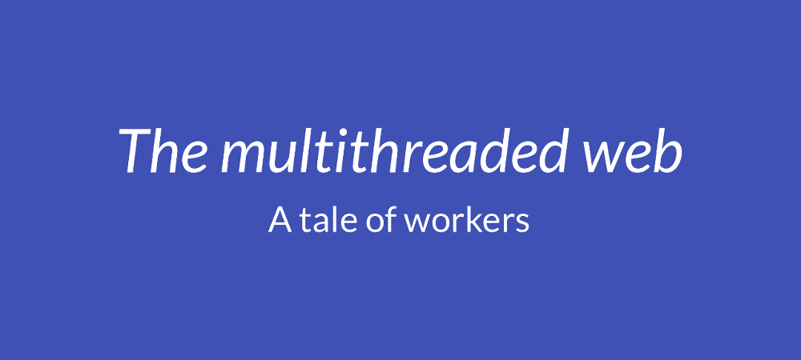

# The multithreaded web: a tale of workers

This repository hosts a couple of simple demos that I wrote for a talk about [Web Workers](https://developer.mozilla.org/en-US/docs/Web/API/Web_Workers_API/Using_web_workers) and [Service Workers](https://developer.mozilla.org/en-US/docs/Web/API/Service_Worker_API/Using_Service_Workers) that I was invited to give at [Source{d} Tech Talks Front 2017](http://talks.sourced.tech/front-2017/).

:video_camera: [Video from the session](https://www.youtube.com/watch?v=yo25lpqKc-E) and [supporting slides](http://slides.com/soyguijarro/multithreaded-web)

:computer: To check the demos yourself:

- Clone the repository with `git clone https://github.com/soyguijarro/multithreaded-web.git`.
- Start [any HTTP static server](https://gist.github.com/willurd/5720255) from the `src` directory of the project. If you have [Node.js](https://nodejs.org/en/) installed, you can just run `npm install && npm start` from the root directory.
- Go to http://localhost:8080 in your browser.

:memo: The demos log different actions to the console, so that you can see what's happening in your browser's developer tools. Logs from the main thread are colored green and those coming from workers are pink.
